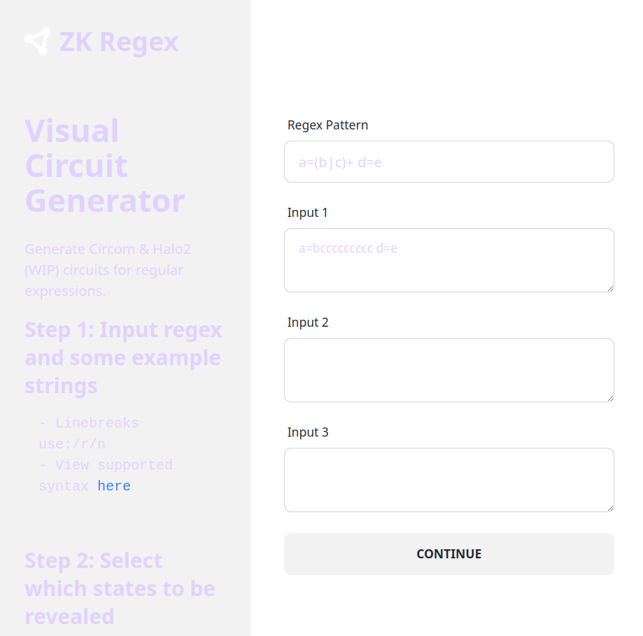

# Zero-Knowledge Certificate (ZK Cert) Proof Architecture

ZkCert uses zero-knowledge proofs to attest the provenance of a comment on an article without revealing the identity of the commenter.

The architecture is based on [ZK Email](https://github.com/zkemail) and their packages and other repos for generating Circom templates, email verifier circuits, regex templates and helpers to match and extract strings from a signed email, set up zk-SNARKs and witnesses, generate Groth16 proving and verifying keys, and optionally generate a Solidity contract to verify proofs on chain in order to trigger other Solidity code to update contract state from the posted comment.

# Regex

A custom Circom circuit is created to match a specially formatted string in an email. We use two types but they can be matched by a single regular expression:
 `/ZKCERT (AUTH|POST) 0x([0-9a-f]{32})/`

There is a web tool hosted by ZK Email at [tool.zkregex.com](https://tool.zkregex.com) for generating circuit code from the string but at time of publishing the service isn't working.



# Circuit Inputs

We need to take any email (a commenter writes this email and sends it to themselves using their institution's email address, e.g. "tomo@mit.edu", and include the formatted auth or post string in the message body) and find the information contained therein to use in the ZKP:
- the RSA signature,
- the public key,
- the body of the email,
- and the hash of the email body

[proof-of-twitter/packages/circuits/helpers/generate-inputs.ts](generate-inputs.ts)

This script uses the npm zk-email/helpers package which must be installed using yarn instead of npm.

```
yarn add @zk-email/circuits @zk-email/helpers @zk-email/contracts
```

Alternatively:

```javascript
import { generateCircuitInputs } from "@zk-email/helpers/dist/input-helpers";
import { verifyDKIMSignature } from "@zk-email/helpers/dist/dkim"
import fs from "fs";
import path from "path";

const rawEmail = fs.readFileSync(
  path.join(__dirname, "./emls/rawEmail.eml"),
  "utf8"
);

const dkimResult = await verifyDKIMSignature(Buffer.from(rawEmail));

const circuitInputs = generateCircuitInputs({
  rsaSignature: dkimResult.signature, // The RSA signature of the email
  rsaPublicKey: dkimResult.rsaPublicKey, // The RSA public key used for verification
  body: dkimResult.body, // body of the email 
  bodyHash: dkimResult.bodyHash, // hash of the email body
  message: dkimResult.message, // the message that was signed (header + bodyHash)
  //Optional to verify regex in the body of email
 shaPrecomputeSelector: STRING_PRESELECTOR, // String to split the body for SHA pre computation 
maxMessageLength: MAX_HEADER_PADDED_BYTES, // Maximum allowed length of the message in circuit
 maxBodyLength: MAX_BODY_PADDED_BYTES, // Maximum allowed length of the body in circuit
 ignoreBodyHashCheck = false, // To be used when ignore_body_hash_check is true in circuit
});

fs.writeFileSync("./input.json", JSON.stringify(circuitInputs));
```

Run: `npx ts-node inputs.ts`

Generates an "input.json".

N.B. The number of padded bytes for the body can be optimized for shorter custom emails and reduce compile times and proving key times.

# Regex Circuit Usage

[proof-of-twitter/packages/circuits/components/twitter_reset_regex.circom](components/twitter_reset_regex.circom)
[proof-of-twitter/packages/circuits/components/twitter_reset.json](components/twitter_reset.json)

NOTE: The name "Twitter" remains unchanged but should be ZkCert.

The output from the tool (at tool.zkregex.com) replaces the forked (then ideally renamed) Twitter regex Circom and JSON used to specify to the api library what string to match and which parts to parse out and make public: AUTH or POST, and the hex code representing a password or comment hash.

[proof-of-twitter/packages/circuits/twitter.circom](twitter.circom) is forked to use the regex circuit from the previous step. Instead of revealing a 21 character Twitter username we reveal the 32 character hex code. The RSA pubkey is of a pre-registered institution's email server instead of x.com (Twitter).

Recall:
`/ZKCERT (AUTH|POST) 0x([0-9a-f]{32})/`

```c
    // Body reveal vars
    var max_twitter_len = 21;
    var max_twitter_packed_bytes = count_packed(max_twitter_len, pack_size); // ceil(max_num_bytes / 7)
    signal input twitter_username_idx;
    signal output reveal_twitter_packed[max_twitter_packed_bytes];

    // TWITTER REGEX: 328,044 constraints
    // This computes the regex states on each character in the email body. For new emails, this is the
    // section that you want to swap out via using the zk-regex library.
    signal (twitter_regex_out, twitter_regex_reveal[max_body_bytes]) <== TwitterResetRegex(max_body_bytes)(in_body_padded);
    // This ensures we found a match at least once (i.e. match count is not zero)
    signal is_found_twitter <== IsZero()(twitter_regex_out);
    is_found_twitter === 0;

    // PACKING: 16,800 constraints (Total: 3,115,057)
    reveal_twitter_packed <== ShiftAndPackMaskedStr(max_body_bytes, max_twitter_len, pack_size)(twitter_regex_reveal, twitter_username_idx);
```

The inputs from the script match up with the "verifier" (e.g. TwitterVerifier) circuit signal inputs and the custom email body regex circuit is called from the verifier circuit and the hex code is revealed as a signal output from the circuit.

# Compile r1cs and wasm

`circom -l node_modules TwitterVerifier.circom -o --r1cs --wasm --sym --c`

Generates 'twitter_js' (${CIRCUIT}_js) with 'generate_witness.js' and *.wasm and *.r1cs.

`node generate_witness.js twitterverifier.wasm input.json witness.wtns`

# snarkjs

We need snarkjs but may use different forks of it.

`npm install snarkjs@git+https://github.com/vb7401/snarkjs.git#24981febe8826b6ab76ae4d76cf7f9142919d2b8`

(or)

`npm install -g snarkjs`

Perform Powers of Tau, find our circuit by CIRCUIT_NAME, setup groth16 keys, export a verification key for our circuit, as well as solidity code for a verifier contract for our circuit.

The process follows the scripts in zk-email-verify/packages/twitter-verifier-circuits/scripts but is handled by running the TypeScript [proof-of-twitter/packages/circuits/scripts/dev-setup.ts](dev-setup.ts). This command in the [blog post](https://prove.email/blog/twitter) will not work so use that script instead:

`snarkjs zkey new pot12_final.ptau twitter.wasm twitter_0000.zkey`

[proof-of-twitter/packages/circuits/scripts/generate-proof.ts](generate-proof.ts)

# Proving

Finally, run the script to generate a proof which can then be verified with snarkjs or by the generated verifier contract.

Deploy [Verifier.sol](Verifier.sol) with foundry (revert pragma for solidity compiler version 0.8.x). Test with a local DKIM registry contract with pubkeys for the email servers of institutions you want to test.

ABI: function verify(uint[] memory input, Proof memory proof) internal view returns (uint)

The proof (proof.json) can also be generated in the browser and verified. See example code:
`zk-email-verify/packages/twitter-verifier-app/pages/MainPage.tsx`
`zk-email-verify/packages/twitter-verifier-app/scripts/generate_input.ts`


